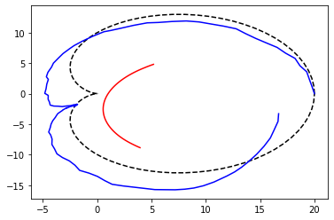

:Version: 1.0
:License: --
:Date: 20/09/2020

Loading GPS data
====================

Many solutions exists to import or build GPS Data.

Import from CSV File
***********************

Import from a GPX File
*************************

Import from a PostgreSQL database
***********************************

You have to precise the paramaters to connect to the database and the SQL statement which returns the GPS records. 

id_T, id_E, id_N, id_U

For example:

.. code-block:: python
    
   from tracklib.io.PostgresReader import PostgresReader
 
   # The SQL statement which returns the GPS records
   sql = ' Select trace, idpoint, '
   sql = sql + '    ST_X(ST_Transform(ST_SetSRID(ST_MakePoint(lon, lat), 3857), 2154)) as lon, '
   sql = sql + '    ST_Y(ST_Transform(ST_SetSRID(ST_MakePoint(lon, lat), 3857), 2154)) as lat, '
   sql = sql + '    timestamp as datetxt '
   sql = sql + ' From c2c_gpx '
   sql = sql + ' Where trace = 184626 '
   sql = sql + ' Order by timestamp '

   # Initialize parameters to connect to the database
   param = {'host':'localhost', 'database':'mabase', 'user':'glagaffe', 'password':'bubulle'}
   PostgresReader.initParam(param)

   # Read and load GPS data from the database.
   trace = PostgresReader.readFromDataBase(sql, 4, 2, 3, -1)
   # Display summary information of the track
   trace.summary()
	

Simulate GPS data
********************

Generate analytical track

.. figure:: ./img/generate_random.png
   :width: 350px
   :align: center

Création d'une trace aléatoire (avec timestamps) suivant la forme d'une cardioïde + un bruit de type marche aléatoire:

.. code-block:: python

   def x(t):
       return 10*math.cos(2*math.pi*t)*(1+math.cos(2*math.pi*t))
   def y(t):
       return 10*math.sin(2*math.pi*t)*(1+math.cos(2*math.pi*t))

   track = Track.generate(x,y)

   def prob():
       return random.random()-0.5

   track.operate(Operator.RANDOM, "", prob, "randx")
   track.operate(Operator.RANDOM, "", prob, "randy")

   track.operate(Operator.INTEGRATOR, "randx", "noisex")
   track.operate(Operator.INTEGRATOR, "randy", "noisey")

   track.operate(Operator.SCALAR_MULTIPLIER, "noisex", 0.5, "noisex")
   track.operate(Operator.SCALAR_MULTIPLIER, "noisey", 0.5, "noisey")

   track.operate(Operator.ADDER, "x", "noisex", "x_noised")
   track.operate(Operator.ADDER, "y", "noisey", "y_noised")

   kernel = GaussianKernel(21)

   track.operate(Operator.FILTER, "x_noised", kernel, "x_filtered")
   track.operate(Operator.FILTER, "y_noised", kernel, "y_filtered")

   plt.plot(track.getAnalyticalFeature("x"), track.getAnalyticalFeature("y"), 'k--')
   plt.plot(track.getAnalyticalFeature("x_noised"), track.getAnalyticalFeature("y_noised"), 'b-')
   plt.plot(track.getAnalyticalFeature("x_filtered"), track.getAnalyticalFeature("y_filtered"), 'r-')

   plt.show()

