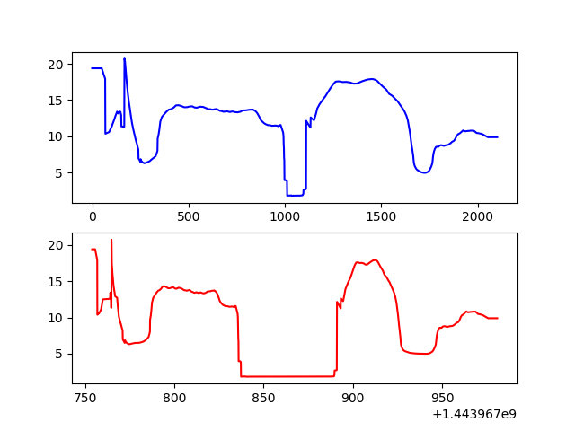

:Author: Marie-Dominique Van Damme
:Version: 1.0
:License: --
:Date: 07/03/2021

Core concept
=================

.. container:: centerside
  
   .. figure:: ./img/dc_track.png
      :width: 700px
      :align: center
		
      Diagramme de classe de Track
		

**TODO**

Obs
*****

Les coordonnées peuvent être sphériques ou cartésiennes

Track
*******

Les attributs *speed* et *abs_curv* ne sont pas calculés. Ils le seront automatiquement en appelant les fonctions:
* getAbsCurv
* getSpeed

Ces 2 attributs font partie des AF de Track. Il faut lancer le calcul si on veut les utiliser pour d'autres calculs d'AF.

.. * extract
.. * split 
.. * Resample
.. * Segmentation
.. * Comparaison de 2 traces
.. * randomizer, noise

		
   Figure 1 : Comparaison de profils de vitesse dans les domaines spatial (en bleu) et temporel (en rouge). On voit bien que le profil spatial est systématiquement plus contracté aux zones de faibles vitesses, et à l'inverse plus dilaté à haute vitesse.

Changement de projection
--------------------------

Opérations mathématiques
----------------------------

De nouvelles surcharges d'opérateurs pour Track et TrackCollection:

* + concatène 2 traces/collections
* - calcule le profil de différence entre 2 traces
* * sur-échantillonne la trace/collection du facteur voulu
* ** rééchantillonne une trace / collection au nombre de points voulu
* / divise une trace/collection en portions à peu près égales
* // rééchantillonne une trace pour faire correspondre ses timestamps à une autre trace
* % supprime des points à intervalle régulier
* <  (flèche vers la gauche) supprime les n derniers points d'une trace
* >  (flèche vers la droite) supprime les n premiers points d'une trace
* [i]  retourne ou modifie la ieme observation / trace
* len( )   nombre d'observations / traces
* le moins "unaire", abs, "!=", ">=" et "<=" restent disponibles si tu as des idées

Tools to query observations in a track with SQL-like commands
---------------------------------------------------------------

Output depends on the SELECT clause:

If "SELECT *" then output is a copied track of the original track (with all its AF hopefully)

.. code-block:: python

    trace = self.track.query("SELECT *")
	
	
	
	
	
    

.. 
    trace = self.track.query("SELECT * WHERE speed < 0.5")
	

	If "SELECT f1, f2... fp", then output is a (p x n)-dimensional array, with p = number of fields 
	queried and n = number of observations selected by the WHERE conditions.
	* If "SELECT AGG1(f1), AGG2(f2)... AGGp(fp)", with AGG1, AGG2,.. AGGp, a set of p aggregators, 
	then output is a p-dimensional array, with on value for each aggregator
	* If "SELECT AGG(f)", then output is the floating point value returned by the operator.

	Note that operators take as input only analytical feature names. Therefore, "SELECT COUNT(*)" syntax 
	is not allowed and must be replaced equivalently by "SELECT COUNT(f)" with any AF name f.

	General rules: 
		#     - Only SELECT and WHERE keywords (SET and DELETE available soon)
		#     - All analytical features + x, y, z, t, and timestamp are available as fields
		#     - Fields are written without quotes. They must not contain blank spaces
		#     - "t" is time as integer in seconds since 1970/01/01 00:00:00, and "timestamp" is GPSTIme object
		#     - Blank space must be used between every other words, symbols and operators
		#     - WHERE clause may contain as many conditions as needed, separated by OR/AND key words
		#     - Parenthesis are not allowed within WHERE clause. Use boolean algebra rules to reformulate 
		#       query without parenthesis: e.g. A AND (B OR C) = A AND B OR A AND C. Or use successive queries.
		#     - Each condition must contain exactly 3 parts (separated by blank spaces) in this exact order:
		#         (1) the name of an analytical feature to test
		#         (2) a comparison operator among >, <, >=, <=, ==, != and LIKE (with % in str and timestamps)
		#         (3) a threshold value which is automatically casted to the type of the AF given in (1). 
		#             Intended types accepted are: integers, floats, strings, boolean and GPSTime. 
		#             When GPSTime is used as a threshold value, eventhough it may contain 2 parts 
		#            (date and time), it must not be enclosed within quotes. For boolean, "1", "T" and "TRUE"
		#             are considered as logical True, all other values are considered as False.    
		#     - Important: no computation allowed in WHERE conditions. E.g. "... WHERE z-2 > 10" not allowed
		#     - Available aggregators: all unary operators as described in Operator.py, except MSE
		#     - Capital letters must be used for SQL keywords SELECT, WHERE, AND, OR and aggregators 

Track collection
*******************

.. raw:: html
   
   
  
