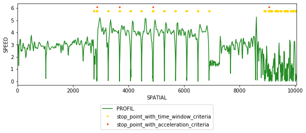

.. TrackLib documentation master file, created by
   sphinx-quickstart on Sat Sep 12 00:35:50 2020.
   You can adapt this file completely to your liking, but it should at least
   contain the root `toctree` directive.

Welcome to TrackLib’s documentation!
=======================================

:Documentation: https://ignf.tracklib.readthedocs.io/
:Source Code: https://github.com/IGNF/tracklib
.. :Issue Tracker: https://github.com/tracklib/tracklib/issues
.. :Stack Overflow: https://stackoverflow.com/questions/tagged/tracklib
.. :PyPI: https://pypi.org/project/tracklib/

Tracklib library provide a variety of tools, operators and functions to manipulate GPS tracks.

.. toctree::
   :maxdepth: 1
   :caption: Tutorials
   
   install
   quickstart
..   convention
   
.. toctree::
   :maxdepth: 1
   :caption: User Guide

   loading
..   coreconcept
..   operator
..   simplify
..   interpolation
..   summarize

TODO :

* Documentation interne

.. Qu'est-ce que j'ai comme fonction pour lire une trace ?

.. > u.search("read")

.. -----------------------------------------------------
.. TRACKLIB FUNCTIONS: 11
.. -----------------------------------------------------
.. GPSTime getReadFormat
.. GPSTime readTimestamp
.. GPSTime readUnixTime
.. GPSTime setReadFormat
.. Track readFromCSV
.. Track readFromDataBase
.. Track readFromGpx
.. FileReader readFromFile
.. FileReader readFromFiles
.. PostgresReader readFromDataBase
.. GpxReader readFromGpx
.. -----------------------------------------------------

.. Ok très bien. La fonction readFromCSV a l'air de correspondre à ce que je cherche. Comment elle fonctionne ?

.. > u.help(Track.estimate_speed)

.. -----------------------------------------------------
.. FUNCTION: estimate_speed
.. -----------------------------------------------------
.. Description: blablabla
.. Input(s):
..     -...
.. Output(s):
..     -...
.. Warning: blablabla
.. -----------------------------------------------------

.. figure:: ./img/Profil_vitesse_temporel_1.png
   :width: 550px
   :align: center
   
   

