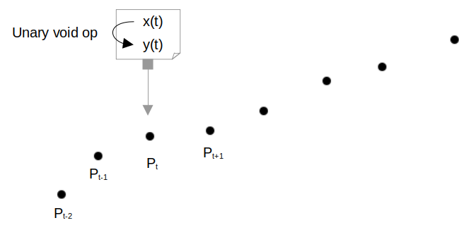
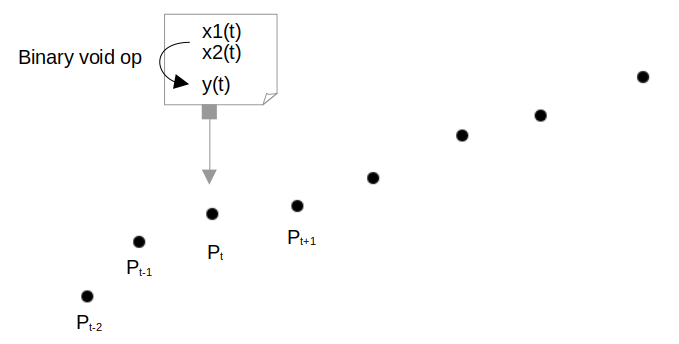
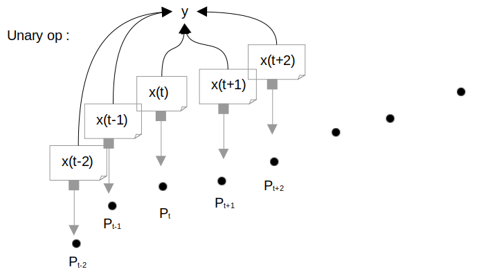
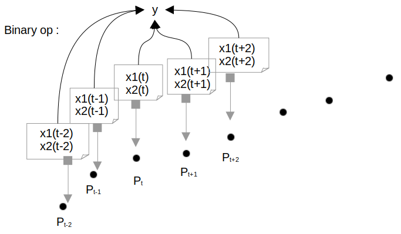

:Author: Marie-Dominique Van Damme
:Version: 1.0
:License: --
:Date: 07/03/2021

Operation classes for manipulating track
==========================================

La librairie tracklib propose une multitude d'opérateurs et de fonctions 
qui permettent de simplifier au maximum la création d'analytical features sur une trace. 
Ils opèrent aussi bien sur les coordonnées que sur le timestamp de la trace. 

.. with points of track
.. (containing operators and functions) 

Les opérations sur les points sont fournies et leur appel évite les parcours des points de la trace. 
Il est aussi possible de se créer son propore opérateur.

Ces opérateurs retournent aussi bien un attribut de la trace, un attribut du point ou une valeur pour la trace

.. which are relational, Boolean, logical, combinatorial, and bitwise,   (math-like expressions) 
.. work with one or more inputs to develop new values. Functions perform specialized tasks, such as computing slope from elevation, 
.. and they usually return numeric values. 
.. you don't have to be a programmer to know how to use operators and functions effectively, you just have to be taught how to use them
.. is a high-level computational language used for performing cartographic spatial analysis using raster da

Fonctions existantes: x(), y(), 

Fonctions à disposition: ds, speed, abs_curv

D'autres algorithmes dans : AlgoAF

Add analytical feature with available operators
*************************************************

..   import tracklib as tl
..   tl.GPSTime.setReadFormat("4Y-2M-2D 2h:2m:2s")
..   chemin = '../data/trace0.gps'
..   trace = tl.FileReader.readFromFile(chemin, 1, 2, 3, -1, separator=",")
   

Unary void operator
----------------------

These operators give us the possibility to create a new analytical feature *y(t)* on the same observation 
according to one existing analytical feature *x(t)*:

	   
   Figure 1 : Apply an unary void operator on an observation

Example :

.. code-block:: python

   trace.operate(tl.Operator.DIFFERENTIATOR, "x", "dx")
   trace.operate(tl.Operator.DIFFERENTIATOR, "y", "dy")
   trace.operate(tl.Operator.SQUARE, "dx", "dx2")
   trace.operate(tl.Operator.SQUARE, "dy", "dy2")

All available unary void operator:

+----------------+---------------------+----------------------------------+
| IDENTITY       | Identity            | y(t) = x(t)                      |
+----------------+---------------------+----------------------------------+
| RECTIFIER      | Rectifier           | y(t) = \|x(t)\|                  |
+----------------+---------------------+----------------------------------+
| INTEGRATOR     | Integrator          | y(t) = y(t-1) + y(t)             |
+----------------+---------------------+----------------------------------+
| SHIFT_RIGHT    | ShiftRight          | y(t) = x(t-1)                    |
+----------------+---------------------+----------------------------------+
| SHIFT_LEFT     | ShiftLeft           | y(t) = x(t+1)                    |
+----------------+---------------------+----------------------------------+
| INVERTER       | Inverter            | y(t) = -x(t)                     |
+----------------+---------------------+----------------------------------+
| DEBIASER       | Debiaser            | y(t) = x(t) - mean(x)            |
+----------------+---------------------+----------------------------------+
| SQUARE         | Square              | y(t) = x(t)*x(t)                 |
+----------------+---------------------+----------------------------------+
| SQRT           | Sqrt                | y(t) = x(t)**(0.5)               |
+----------------+---------------------+----------------------------------+
| NORMALIZER     | Normalizer          | y(t) = (x(t) - mean(x))/sigma(x) |
+----------------+---------------------+----------------------------------+
| DIFFERENTIATOR | Differentiator      | y(t) = x(t) - x(t-1)             |
+----------------+---------------------+----------------------------------+
| DIODE          | Diode               | y(t) = 1[x>0] * x(t)             |
+----------------+---------------------+----------------------------------+
| SIGN           | Sign                | y(t) = x(t)/\|x(t)\|             |
+----------------+---------------------+----------------------------------+
| EXP            | Exp                 | y(t) = exp(x(t))                 |
+----------------+---------------------+----------------------------------+
| LOG            | Log                 | y(t) = log(x(t))                 |
+----------------+---------------------+----------------------------------+

	 
Binary void operator
----------------------

These operators give us the possibility to create a new analytical feature *y(t)* on the same observation 
according to two existing analytical features *x1(t)* and *x2(t)*:

	   
   Figure 2 : Apply a binary void operator on an observation

Example :

.. code-block:: python

   track.operate(Operator.ADDER, "dx2", "dy2", "dx2+dy2")

All available binary void operator:

+--------------------+---------------------+---------------------------------------------------+
| ADDER              | Adder               | y(t) = x1(t) + x2(t)                              |
+--------------------+---------------------+---------------------------------------------------+
| SUBSTRACTER        | Substracter         | y(t) = x1(t) - x2(t)                              |
+--------------------+---------------------+---------------------------------------------------+
| MULTIPLIER         | Multiplier          | y(t) = x1(t) * x2(t)                              |
+--------------------+---------------------+---------------------------------------------------+
| DIVIDER            | Divider             | y(t) = x1(t) / x2(t)                              |
+--------------------+---------------------+---------------------------------------------------+
| POWER              | Power               | y(t) = x1(t) ** x2(t)                             |
+--------------------+---------------------+---------------------------------------------------+
| RENORMALIZER       | Renormalizer        | y(t) = (x1(t)-m(x1))* s(x2)/s(x1) + m(x2)         |
+--------------------+---------------------+---------------------------------------------------+
| DERIVATOR          | Derivator           | y(t) = (x1(t)-x1(t-1))/(x2(t)-x2(t-1)) = dx1/dx2  |
+--------------------+---------------------+---------------------------------------------------+
| POINTWISE_EQUALER  | PointwiseEqualer    | y(t) = 1 if x1(t)=x2(t), 0 otherwise              |
+--------------------+---------------------+---------------------------------------------------+
| CONVOLUTION        | Convolution         | y(t) = int(x1(h)*x2(t-h)dh)                       |
+--------------------+---------------------+---------------------------------------------------+

 
Unary operator
-----------------

These operators give us the possibility to create a new analytical feature *y* on the trajectory 
according to one existing analytical feature *x(t)* defined on all observations:

	   
   Figure 3 : Apply a unary operator on a trajectory

Example :

.. code-block:: python

   trace.addAnalyticalFeature(tl.speed)
   moyspeed = trace.operate(tl.Operator.AVERAGER, "speed", "mspeed")
   medspeed = trace.operate(tl.Operator.MEDIAN, "speed", "mspeed")
   trace.plotAnalyticalFeature('speed', 'BOXPLOT')
   print (moyspeed, medspeed)

All available unary operator:

+------------+---------------------+-------------------------------+
| SUM        | Sum operator        | y = sum(x)                    |
+------------+---------------------+-------------------------------+
| AVERAGER   | Average operator    | y = mean(x)                   |
+------------+---------------------+-------------------------------+
| VARIANCE   |                     | y = Var(x)                    |
+------------+---------------------+-------------------------------+
| STDDEV     | Standard deviation  | y = sqrt(Var(x))              |
+------------+---------------------+-------------------------------+
| MSE        | Mean square         | y = mean(x**2)                |
+------------+---------------------+-------------------------------+
| RMSE       | Root mean square    | y = sqrt(mean(x**2))          |
+------------+---------------------+-------------------------------+
| MAD        |                     | y = median(abs(x))            |
+------------+---------------------+-------------------------------+
| MIN        |                     | y = min(x)                    |
+------------+---------------------+-------------------------------+
| MAX        |                     | y = max(x)                    |
+------------+---------------------+-------------------------------+
| MEDIAN     |                     | y = median(x)                 |
+------------+---------------------+-------------------------------+
| ARGMIN     |                     | y = min {t | x(t) = min(x)}   |
+------------+---------------------+-------------------------------+
| ARGMAX     |                     | y = min {t | x(t) = max(x)}   |
+------------+---------------------+-------------------------------+
| ZEROS      |                     | y = {t | x(t) = 0}            |
+------------+---------------------+-------------------------------+

Binary operator
-------------------

These operators give us the possibility to create a new analytical feature *y* on the trajectory 
according to two existing analytical features *x1(t)* and *x2(t)* defined on all observations:

	   
   Figure 4 : Apply a binary operator on a trajectory

All available unary operator:

+--------------+---------------------+---------------------------------------+
| COVARIANCE   | Covariance          | y = m[x1x2] - m[x1]*m[x2]             |
+--------------+---------------------+---------------------------------------+
| CORRELATOR   | Correlator          | y = cov(x1,x2)/(sigma(x1)*sigma(x2))  |
+--------------+---------------------+---------------------------------------+
| L0           | L0Diff              | y = #{t | x1(t) != x2(t)}             |
+--------------+---------------------+---------------------------------------+
| L1           | L1Diff              | y = mean(|x1(t)-x2(t)|)               |
+--------------+---------------------+---------------------------------------+
| L2           | L2Diff              | y = mean(|x1(t)-x2(t)|**2)            |
+--------------+---------------------+---------------------------------------+
| LINF         | LInfDiff            | y = max(|x1(t)-x2(t)|)                |
+--------------+---------------------+---------------------------------------+
| EQUAL        | Equal               | y = 1 if {x1(t) = x2(t) for all t}    |
+--------------+---------------------+---------------------------------------+
 

Scalar operator
-----------------

.. Ces opérateurs permettent

+--------------+---------------------+-----------------------------------------------+
| AGGREGATE    | Aggregate           | y(t) = arg({x(t)})   (arg is a list function) |
+--------------+---------------------+-----------------------------------------------+

Scalar void operator
---------------------

.. Ces opérateurs permettent 

+---------------+---------------------+------------------------------------------------------------------------+
| SHIFT         |                     | y(t) = x(t-arg) with arg a integer                                     |
+---------------+---------------------+------------------------------------------------------------------------+
| APPLY         |                     | y(t) = arg(x(t)) with arg a real function                              |
+---------------+---------------------+------------------------------------------------------------------------+
| FILTER        |                     | y(t) = int[x(z)*h(t-z)dz] with arg an odd-dimension vector or a kernel |
+---------------+---------------------+------------------------------------------------------------------------+
| SCALAR_ADDER  |                     |                                                                        |
+---------------+---------------------+------------------------------------------------------------------------+
| RANDOM        |                     |                                                                        |
+---------------+---------------------+------------------------------------------------------------------------+
| THRESHOLDER   |                     |                                                                        |
+---------------+---------------------+------------------------------------------------------------------------+

Application
*************

Calculation of the root mean square error 

**TODO**

.. Simulate GPS data
.. --------------------

.. Generate analytical track

.. .. figure:: ./img/generate_random.png
..    :width: 350px
..    :align: center

.. Création d'une trace aléatoire (avec timestamp) suivant la forme d'une cardioïde + un bruit de type marche aléatoire:

.. .. figure:: ./img/generate.png
..   :width: 350px
..   :align: center

New operators statement syntax
********************************

To create a new operator named *nom_operateur*:

.. code-block:: python

   class nom_operateur (<type_operateur>):
       
       def execute(self, track, af_input, kernel, af_output):
           temp = [0]*track.size()
           track.createAnalyticalFeature(af_output)
           utils.addListToAF(track, af_output, temp)
           return temp

Depends on what you want to create, **type_operateur** will specify your choice.

Add analytical feature with algorithm
***************************************

.. code-block:: python

   trace.addAnalyticalFeature(tl.speed)

New algorithms statement syntax
*********************************

To create a new algorithm named *nom_operateur*:

.. code-block:: python

   def nom_operateur(track, i):

