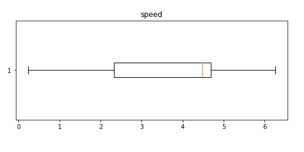

Quick start 
=============

.. code-block:: python

	import matplotlib.pyplot as plt

	import tracklib.algo.Interpolation as interp
	import tracklib.core.Obs as obs
	from tracklib.core.GPSTime import GPSTime
	from tracklib.io.GpxReader import GpxReader
	from tracklib.core.Coords import GeoCoords
	from tracklib.core.Operator import Operator

	# ------------------------------------------------------------------
	# Read data and plot track
	# ------------------------------------------------------------------
	GPSTime.setReadFormat("4Y-2M-2DT2h:2m:2sZ")
	tracks = GpxReader.readFromGpx("../data/activity_5807084803.gpx")
	trace = tracks[0]

	base_geo = trace.getFirstObs().position
	base = GeoCoords(base_geo.getX(), base_geo.getY(), base_geo.getZ())
	for i in range(trace.size()):
	    x = trace.getObs(i).position.getX()
		y = trace.getObs(i).position.getY()
		z = trace.getObs(i).position.getZ()
		geo = GeoCoords(x, y, z)
		enu = geo.toENUCoords(base)
		trace.setObs(i, obs.Obs(enu,trace.getObs(i).timestamp))

	trace.plot()
	
	
.. figure:: ./img/quickstart_1.png
   :width: 550px
   :align: center

   Figure 1 : Trajectory plot 

.. code-block:: python

	# ------------------------------------------------------------------
	#  Compute local speed and display boxplot of speed observations
	# ------------------------------------------------------------------
	trace.estimate_speed()
	trace.operate(Operator.DIFFERENTIATOR, "speed", "dv")
	trace.plotAnalyticalFeature('speed', 'BOXPLOT')
	

   Figure 2 : Speed observations boxplot 

.. code-block:: python

	# ------------------------------------------------------------------
	#  Compute speed change 
	# ------------------------------------------------------------------
	trace.operate(Operator.RECTIFIER, "dv", "absdv")
	trace.plotAnalyticalFeature("absdv", "PLOT")
	
.. figure:: ./img/quickstart_3.png
   :width: 550px
   :align: center

   Figure 3 : Speed change according to the curvilinear abscissa

.. code-block:: python

	# ------------------------------------------------------------------
	#  Segmentation
	# ------------------------------------------------------------------
	trace.segmentation(["absdv"], "speed_decoup", [1.5])
	
	# ------------------------------------------------------------------
	# + récupération d'un sous-ensemble de traces 
	# + interpolation/lissage + ré-estimation des vitesses...
	# ------------------------------------------------------------------
	seg = trace.split_segmentation("speed_decoup")

	COLORS = ['k-','r-','g-','b-','y-','m-','c-']

	count = 0
	interp.SPLINE_PENALIZATION = 1e-2
	for i in range(len(seg)):
		trace = seg[i]
		if (trace.length() < 50):
			continue

		count += 1
		trace.resample(1, interp.ALGO_THIN_SPLINES, interp.MODE_SPATIAL)
		trace.estimate_speed()
		diff = trace.getLastObs().timestamp-trace.getFirstObs().timestamp
		v = round(trace.length()/diff*3.6,2)
		vm = round(trace.operate(Operator.MAX, "speed")*3.6,2)
		vc = round(100/(trace.getObs(150).timestamp-trace.getObs(50).timestamp)*3.6,2)
		print("Rep", count, ":  vmoy = ", v, "km/h   vmax = ", vm, " km/h   vc = ", vc, "km/h")
		plt.plot(trace.getX(), trace.getY(), COLORS[i%7])

	plt.show()

.. figure:: ./img/quickstart_4.png
   :width: 550px
   :align: center

   Figure 4 : Segmentation per speed change

