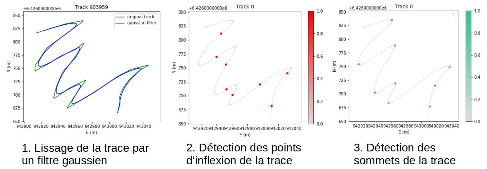
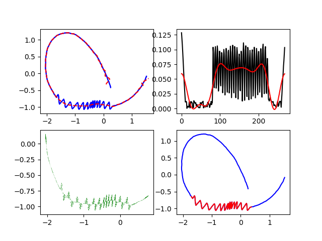

:Author: Marie-Dominique Van Damme
:Version: 1.0
:License: --
:Date: 06/03/2022

Sinuous road section
=====================

.. Proposal of two methods to detect sinuous road sections.
.. Un point d'inflexion est un point où la courbe change de convexité.

   Figure 1 : Méthode Plazanet

.. note:: Reference: Plazanet, Corinne Margote. (2001). Modeling Geometry for Linear Feature Generalization. 

   Figure 2 : Le filtrage de Fourier pour la détection des virages en lacets

		