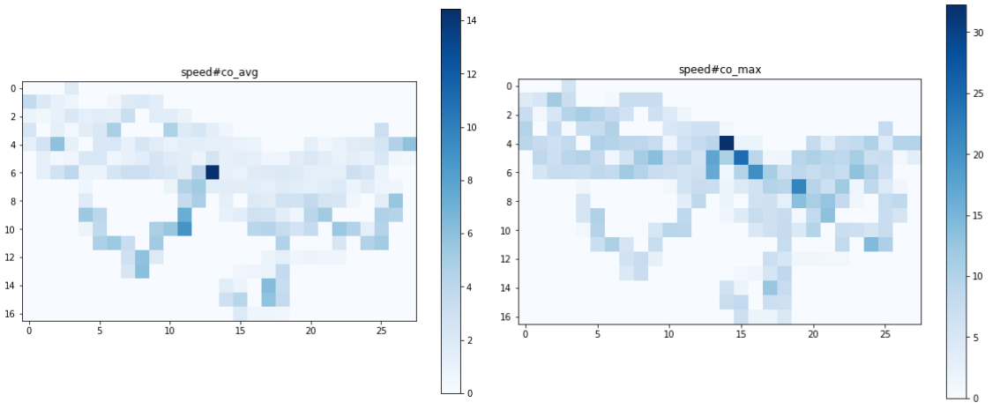

:Author: Marie-Dominique Van Damme
:Version: 1.0
:License: --
:Date: 07/03/2021

Summarize GPS information
==========================

Example
---------

.. code-block:: python

	import os
	import time

	from tracklib.core.Coords import GeoCoords
	import tracklib.io.GpxReader as gpx
	import tracklib.algo.AlgoAF as algo
	from tracklib.core.GPSTime import GPSTime

	import tracklib.core.Grid as g
	import tracklib.core.TrackCollection as trackCollection
	import tracklib.util.CellOperator as celloperator

	GPSTime.setReadFormat("4Y-2M-2DT2h:2m:2s1Z")

	# Load gpx files
	pathdir = '/PATH/GPS/'
	LISTFILE = os.listdir(pathdir)
	TRACES = []
	for f in LISTFILE:

		(lon, lat, ele) = gpx.GpxReader.readFirstPointFromGpx(pathdir + f)
		time.sleep(3)
		base_geo = GeoCoords(lon, lat, ele)
		base = GeoCoords(base_geo.getX(), base_geo.getY(), base_geo.getZ())
		traces = gpx.GpxReader.readFromGpx(pathdir + f, base)

		trace = traces[0]

		trace.addAnalyticalFeature(algo.ds)
		trace.addAnalyticalFeature(algo.speed)

		TRACES.append(trace)

	# Create a collection of tracks
	collection = trackCollection.TrackCollection(TRACES)
	#collection.plot()

	# Compute bounding box
	(Xmin, Xmax, Ymin, Ymax) = collection.bbox()
	XSize = Xmax - Xmin
	YSize = Ymax - Ymin
	PixelSize = 500

	# Create a grid
	grille = g.Grid(Xmin, Ymin, XSize, YSize, PixelSize)

	# Summarize
	af_algos = [algo.speed, algo.speed]
	cell_operators = [celloperator.co_avg, celloperator.co_max]
	grille.addAnalyticalFunctionForSummarize(TRACES, af_algos, cell_operators)
	
	# Plot rasters
	grille.plot(algo.speed, celloperator.co_avg)
	grille.plot(algo.speed, celloperator.co_max)

   Figure 2 : Two features: mean speeds (left) and max speeds (right

