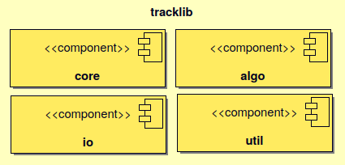

:Author: Marie-Dominique Van Damme
:Version: 1.0
:License: --
:Date: 01/04/2022

Bird's eye view on Tracklib
============================

The aim of this page is to give you a high level overview of how Tracklib works: an introduction 
of the description of the four packages that make up Tracklib Framework.

   
   Package diagram of Tracklib framework

core 
------

	Definition and implementation of central classes of Tracklib framework: Track, TrackCollection, etc. 
	
	=================== ====================================================================
	Module                Purpose
	=================== ====================================================================
	``Bbox``             Class to manage bounding box
	``Coords``           Classes to manage point coordinates: GeoCoords, ENUCoords, ECEFCoords
	``GPSTime``          Class to manage timestamps
	``Kernel``           Kernel Class for filtering, smoothing and stochastics simulations
 	``Network``          Node, Edge and Network Class 
	``Obs``              Class to define an observation
	``Operator``         Classes to manage the operators
	``Plot``             Class to plot GPS tracks and its AF
	``Raster``           Class to manipulate rasters
	``RasterBand``       Class for defining a raster band
	``SpatialIndex``     Class to manipulate a spatial index
	``Track``            Class to manage GPS tracks
	``TrackCollection``  Class to manage a collection of tracks
	=================== ====================================================================

io
----
	Implements for reading and/or writting tracks and networks in CSV, GPX, KML, ASCII file.

algo
------

	Algorithms implementation for manipulate track like: interpolate, smoothing, segmentation, 
	filtering, simplify, compare, mapping on another track or on network
	
    .. raw:: html
	
	    <table border="2" style='width:650px;' cellspacing="0" cellpadding="10">
	    <caption>Algorithms implementation to manage track</caption>
	    <thead>
            <colgroup>
              <col width="120px" />
              <col span="1" />
            </colgroup>
            <tr>
              <th align="left" style="font-weight:bold;background-color:#f1f1f1;">Module</th>
              <th align="center" style="background-color:#f1f1f1;">Purpose</th>
              <th align="center" style="background-color:#f1f1f1;">Functions available</th>
            </tr>
        </thead>
	    <tr>
    	    <td>Analytics</td>
	        <td>Functions to compute Analytical Features like 
   	                    speed, ds, abs_curv, orientation, curve, etc.</td>
            <td></td>
        </tr>
        <tr>
            <td>Cinematics</td>
            <td>Functions to manage cinematic computations on GPS tracks</td>
            <td></td>
        </tr>
        <tr>
            <td>Comparison</td>
            <td>Functions to manage comparisons of GPS tracks</td>
            <td>centralTrack, compare, differenceProfile</td>
        </tr>
        <tr>
            <td>Dynamics</td>
            <td>Functions to manage cinematic computations on GPS tracks</td>
            <td></td>
        </tr>
        <tr>
            <td>Filtering</td>
            <td>Functions to manage filtering of GPS tracks</td>
            <td></td>
        </tr>
        <tr>
            <td>Geometrics</td>
            <td>Functions to manage general operations on a track</td>
            <td></td>
        </tr>
        <tr>
            <td>Interpolation</td>
            <td></td>
            <td></td>
        </tr>
        <tr>
            <td>Mapping</td>
            <td>Functions to transfer information between track and 
            raster or between track and network</td>
            <td></td>
        </tr>
        <tr>
            <td>Segmentation</td>
            <td>Functions to manage segmentation of GPS tracks</td>
            <td></td>
        </tr>
        <tr>
            <td>Selection</td>
            <td></td>
            <td></td>
        </tr>
        <tr>
            <td>Simplification</td>
            <td>Functions to manage simplification of GPS tracks</td>
            <td>simplify</td>
        </tr>
        <tr>
            <td>Stochastics</td>
            <td></td>
        </tr>
        <tr>
            <td>Summarising</td>
            <td></td>
            <td>summarize</td>
        </tr>
        <tr>
            <td>Synthetics</td>
            <td></td>
            <td></td>
        </tr>
        </table>
	
	
util
------

	Tools like geometry functions or color function for the visualization
	
	================== ====================================================================
	Module                Purpose
	================== ====================================================================
	``Geometry`` 	    Geometric functions
	``Qgis``     	    Functions to display results tracklib in QGis software
	================== ====================================================================

