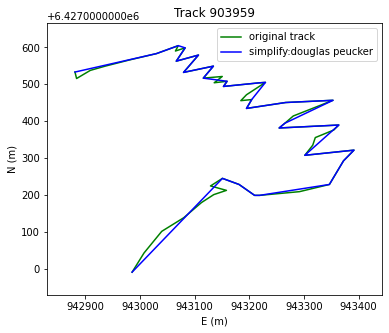
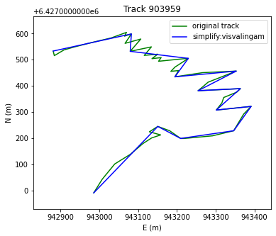
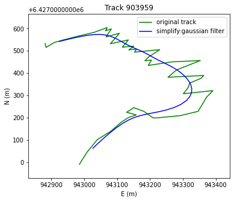
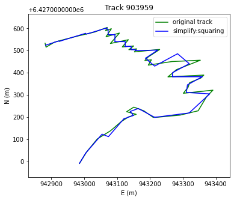

:Author: Marie-Dominique Van Damme
:Version: 1.0
:License: --
:Date: 07/03/2021, 06/03/2022

Simplify a track
=================

We present on this page four filtering algorithms for track by using Douglas & Peucker simplification, 
Visvalingram simplification, kernel and squaring algorithms.

The process "Track simplification" generally returns a new simplified track. 
Tolerance is in the unit of track observation coordinates.

We use the same sample track in the 4 examples. For loading the data:

.. code-block:: python

  from tracklib.io.FileReader import FileReader
  import tracklib.algo.Simplification as Simplification

  chemin = './data/lacet/ecrins.csv'
  tracks = FileReader.readFromWKTFile(chemin, 0, 1, 2, ",", 1, 
                                    "ENUCoords", None, True)
  trace = tracks["903959","%"][0]
  trace = trace.extract(70,120)

  trace.summary()

Douglas-Peucker Simplication
*****************************

The Douglas-Peucker algorithm reduce the number of a line by reducing the number of points. The result should keep the original shape.

.. code-block:: python

  tolerance = 20
  trace2 = Simplification.simplify(trace, tolerance, 
			 Simplification.MODE_SIMPLIFY_DOUGLAS_PEUCKER)
  trace.plot(append = False, sym='g-')
  trace2.plot(append = True, sym='b-')

   Figure 1 : Simplification with Douglas Peucker

.. note:: Reference: David Douglas, Thomas Peucker: Algorithms for the reduction of the number of points required to represent a digitized line or its caricature. 
        In Cartographica: The International Journal for Geographic Information and Geovisualization. 
        Volume 10, Issue 2, Pages 112–122, 1973, `https://utpjournals.press/doi/10.3138/FM57-6770-U75U-7727 <https://utpjournals.press/doi/10.3138/FM57-6770-U75U-7727>`_
		

Visvalingram Simplification
****************************

The Visvalingram algorithm simplify the geometry of the track by reducing the number of points but the result presents 
less angular results than the Douglas-Peucker algorithm.

.. code-block:: python

  tolerance = 50
  trace3 = Simplification.simplify(trace, tolerance, 
			 Simplification.MODE_SIMPLIFY_VISVALINGAM)
  trace.plot(append = False, sym='g-', label='original track')
  trace3.plot(append = True, sym='b-', label='simplify:visvalingam')
  plt.legend()

   Figure 2 : Simplification with Visvalingram

.. note:: Reference: M. Visvalingam & J. D. Whyatt (1993) Line generalisation by repeated elimination of points, The Cartographic Journal, 30:1, 46-51, DOI: 
          `10.1179/000870493786962263 <10.1179/000870493786962263>`_

Kernel simplification
**********************

Build a kernel. For example a `Gaussian Filter <https://tracklib.readthedocs.io/en/latest/api/core/core-kernel.html#tracklib.core.Kernel.GaussianKernel>`__:

.. math::

    f(x)=\frac{e^{-0.5 \cdot \left(x/\sigma \right)^2}}
    {\sigma \cdot \sqrt{2 \cdot \pi}}

.. code-block:: python

  kernel = GaussianKernel(3)
  trace.operate(Operator.FILTER, "x", kernel, "x_filtered")
  trace.operate(Operator.FILTER, "y", kernel, "y_filtered")
  trace.plot(append = False, sym='g-', label='original track')
  plt.plot(trace.getAnalyticalFeature("x_filtered"), trace.getAnalyticalFeature("y_filtered"), 
		 'b-', label='simplify:gaussian filter')
  plt.legend()

   Figure 3 : Simplification with a gaussian kernel filter

Squaring algorithm
*******************

.. code-block:: python

  tolerance = 3
  trace1 = Simplification.simplify(trace, tolerance, 
			 Simplification.MODE_SIMPLIFY_SQUARING)
  trace.plot(append = False, sym='g-')
  trace1.plot(append = True, sym='b-')

   Figure 4 : Simplification with squaring algorithm

.. note:: Reference: Lokhat, Imran & Touya, Guillaume. (2016). Enhancing building footprints with squaring operations. 
          Journal of Spatial Information Science. 13. `10.5311/JOSIS.2016.13.276 <http://dx.doi.org/10.5311/JOSIS.2016.13.276>`_

